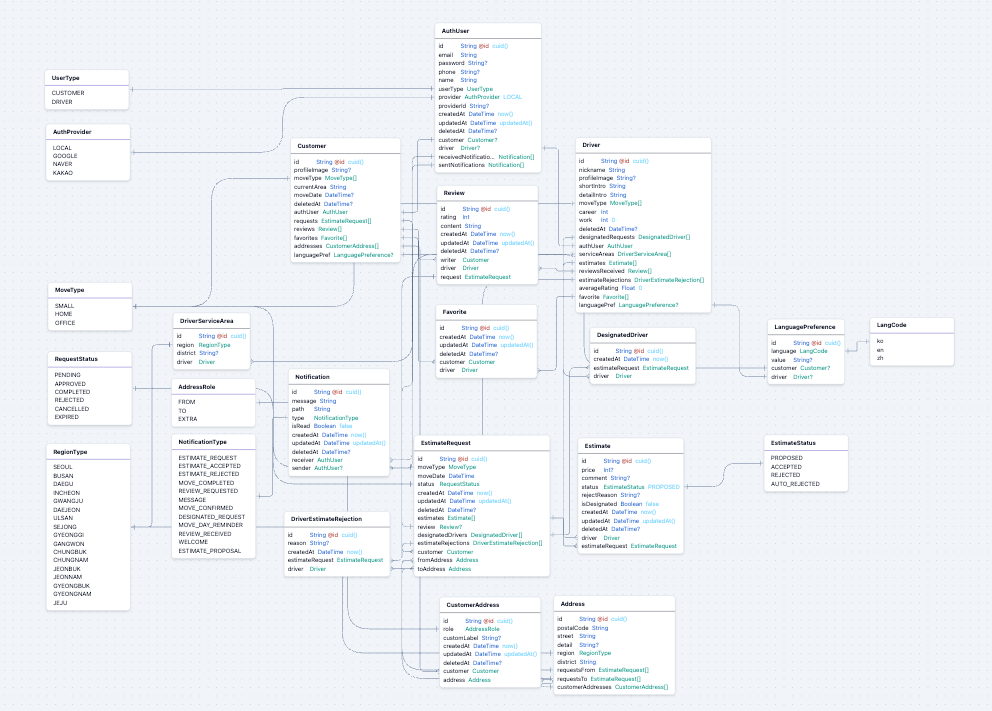

# 🖼️ 무빙(BE)

### 무빙 한줄소개


### [🖼️ 무빙 구경하기 : https://www.moving-2.click](https://www.moving-2.click/)

### [📋 Team Notion 바로가기](https://www.notion.so/217fff3108c98098bd43fdc393e922a1?v=217fff3108c981078f8c000cd9c3e859_link)

### [🔗 6-moving-team2-FE 바로가기](https://github.com/sebiny/6-moving-team2-FE)

### [Swagger API](https://api.moving-2.click/api-docs/)

<br>

# 👨‍👩‍👧‍👦 **팀원 소개**

<div align="center">

|                                                               안세빈                                                               |                                                               최민경                                                                |                                                               김다은                                                                |                                                                김단이                                                                |                                                                오보람                                                                |                                                               이지수                                                                |                                                                황수정                                                                |
| :--------------------------------------------------------------------------------------------------------------------------------: | :---------------------------------------------------------------------------------------------------------------------------------: | :---------------------------------------------------------------------------------------------------------------------------------: | :----------------------------------------------------------------------------------------------------------------------------------: | :----------------------------------------------------------------------------------------------------------------------------------: | :---------------------------------------------------------------------------------------------------------------------------------: | :----------------------------------------------------------------------------------------------------------------------------------: |
| [](https://github.com/sebiny) | [](https://github.com/choi-mk) | [](https://github.com/fs6-kde) | [](https://github.com/danikim8) | [](https://github.com/elisaohh) | [](https://github.com/afafmmm) | [](https://github.com/suejeong) |
|                                                                팀장                                                                |                                                               부팀장                                                                |                                                                팀원                                                                 |                                                                 팀원                                                                 |                                                                 팀원                                                                 |                                                                팀원                                                                 |                                                                 팀원                                                                 |
|                                                            리뷰, 다국어                                                            |                                                 기사님 찾기, 기사님 마이페이지, AWS                                                 |                                                             견적 (고객)                                                             |                                                         견적 (기사), 스키마                                                          |                                                       견적 요청서 작성 (고객)                                                        |                                                          인증 및 유저, AWS                                                          |                                                           알림, 랜딩페이지                                                           |

</div>
<br>

# 📑 프로젝트 소개

<br>

# 📆 프로젝트 기간

### 2025.07.01 - 2025.08.18

<br>
  
# ⚙️ 기술 스택
| Category | Tech Stack |
| -------- | ---------- |
| **Backend** |      |
| **Library** |          |
| **Deploy** |         |
| **Tool** |    |

<br>

# 🗂️ 프로젝트 구조

<details>
<summary>
🗄️ ERD (Entity Relationship Diagram)

</summary>
<div markdown="1">



</div>
</details>

<details>
<summary>
Backend 폴더구조

</summary>
<div markdown="1">

```
📦 be/                           # 백엔드 프로젝트 루트
┣ 📂.github                      # GitHub 관련 설정
┃ ┗ 📂workflows                  # CI/CD 워크플로우 (GitHub Actions)
┃   ┗ 📜deploy.yml               # 배포 파이프라인 설정
┣ 📂node_modules                  # 설치된 라이브러리 (자동 생성)
┣ 📂prisma                       # 데이터베이스 관련
┃ ┣ 📂migrations                 # Prisma 마이그레이션 파일
┃ ┣ 📜schema.prisma              # Prisma 스키마 정의 파일
┃ ┣ 📜seed.ts                    # 초기 데이터 시드 스크립트
┃ ┣ 📜seed2.ts                   # 추가 시드 데이터
┃ ┣ 📜seed3.ts                   # 테스트용 시드 데이터
┃ ┗ 📜testSeed.ts                # 테스트 시드 데이터
┣ 📂src                          # 소스 코드
┃ ┣ 📂config                     # 환경 설정
┃ ┃ ├── 📜prisma.ts              # Prisma 클라이언트 설정
┃ ┃ └── 📜passport.ts            # Passport 인증 설정
┃ ┣ 📂controllers                # 요청-응답 처리 (Express 컨트롤러)
┃ ┃ ├── 📜auth.controller.ts     # 인증 관련 컨트롤러
┃ ┃ ├── 📜driver.controller.ts   # 기사 관련 컨트롤러
┃ ┃ ├── 📜estimateReq.controller.ts # 견적 요청 컨트롤러
┃ ┃ ├── 📜customerEstimate.controller.ts # 고객 견적 컨트롤러
┃ ┃ ├── 📜notification.controller.ts # 알림 컨트롤러
┃ ┃ ├── 📜profile.controller.ts  # 프로필 컨트롤러
┃ ┃ ├── 📜review.controller.ts   # 리뷰 컨트롤러
┃ ┃ ├── 📜favorite.controller.ts # 즐겨찾기 컨트롤러
┃ ┃ ├── 📜address.controller.ts  # 주소 컨트롤러
┃ ┃ ├── 📜shareEstimate.controller.ts # 견적 공유 컨트롤러
┃ ┃ └── 📜*.controller.test.ts   # 컨트롤러 테스트 파일들
┃ ┣ 📂services                   # 비즈니스 로직 계층
┃ ┃ ├── 📜auth.service.ts        # 인증 서비스
┃ ┃ ├── 📜driver.service.ts      # 기사 서비스
┃ ┃ ├── 📜estimateReq.service.ts # 견적 요청 서비스
┃ ┃ ├── 📜customerEstimate.service.ts # 고객 견적 서비스
┃ ┃ ├── 📜notification.service.ts # 알림 서비스
┃ ┃ ├── 📜profile.service.ts     # 프로필 서비스
┃ ┃ ├── 📜review.service.ts      # 리뷰 서비스
┃ ┃ ├── 📜favorite.service.ts    # 즐겨찾기 서비스
┃ ┃ ├── 📜address.service.ts     # 주소 서비스
┃ ┃ ├── 📜estimateCompletion.service.ts # 견적 완료 서비스
┃ ┃ └── 📜*.service.test.ts      # 서비스 테스트 파일들
┃ ┣ 📂repositories               # DB 접근 계층 (Prisma 쿼리 모음)
┃ ┃ ├── 📜auth.repository.ts     # 인증 리포지토리
┃ ┃ ├── 📜driver.repository.ts   # 기사 리포지토리
┃ ┃ ├── 📜estimateReq.repository.ts # 견적 요청 리포지토리
┃ ┃ ├── 📜customerEstimate.repository.ts # 고객 견적 리포지토리
┃ ┃ ├── 📜notification.repository.ts # 알림 리포지토리
┃ ┃ ├── 📜profile.repository.ts  # 프로필 리포지토리
┃ ┃ ├── 📜review.repository.ts   # 리뷰 리포지토리
┃ ┃ ├── 📜favorite.repository.ts # 즐겨찾기 리포지토리
┃ ┃ ├── 📜address.repository.ts  # 주소 리포지토리
┃ ┃ └── 📜*.repository.test.ts   # 리포지토리 테스트 파일들
┃ ┣ 📂routes                     # 라우터 정의
┃ ┃ ├── 📜auth.router.ts         # 인증 라우터
┃ ┃ ├── 📜driver.router.ts       # 기사 공개 라우터
┃ ┃ ├── 📜driverPrivate.router.ts # 기사 인증 라우터
┃ ┃ ├── 📜estimateReq.router.ts  # 견적 요청 라우터
┃ ┃ ├── 📜customerEstimate.router.ts # 고객 견적 라우터
┃ ┃ ├── 📜notification.router.ts # 알림 라우터
┃ ┃ ├── 📜profile.router.ts      # 프로필 라우터
┃ ┃ ├── 📜review.router.ts       # 리뷰 라우터
┃ ┃ ├── 📜favorite.router.ts     # 즐겨찾기 라우터
┃ ┃ ├── 📜address.router.ts      # 주소 라우터
┃ ┃ ├── 📜shareEstimate.router.ts # 견적 공유 라우터
┃ ┃ └── 📜translateRouter.ts     # 번역 라우터
┃ ┣ 📂middlewares                # Express 미들웨어
┃ ┃ ├── 📜errorHandler.ts        # 에러 핸들러
┃ ┃ ├── 📜authLimiter.ts         # 인증 제한
┃ ┃ ├── 📜cacheMiddleware.ts     # 캐시 미들웨어
┃ ┃ ├── 📜uploadMiddleware.ts    # 파일 업로드 미들웨어
┃ ┃ ├── 📜estimateCompletion.ts  # 견적 완료 미들웨어
┃ ┃ └── 📂passport               # Passport 전략
┃ ┃   ├── 📜jwtStrategy.ts       # JWT 전략
┃ ┃   └── 📜socialStrategy.ts    # 소셜 로그인 전략
┃ ┣ 📂utils                      # 유틸리티 함수 모음
┃ ┃ ├── 📜asyncHandler.ts        # 비동기 핸들러 래퍼
┃ ┃ ├── 📜customError.ts         # 커스텀 에러 클래스
┃ ┃ ├── 📜getCookieDomain.ts     # 쿠키 도메인 설정
┃ ┃ ├── 📜notificationMessage.ts # 알림 메시지 생성
┃ ┃ ├── 📜cronScheduler.ts       # 크론 스케줄러
┃ ┃ ├── 📜estimateCompletionScheduler.ts # 견적 완료 스케줄러
┃ ┃ ├── 📜moveReminder.ts        # 이사 알림
┃ ┃ └── 📜resetDB.ts             # DB 리셋 유틸리티
┃ ┣ 📂types                      # 타입 정의 (TS 인터페이스, 타입 등)
┃ ┃ ├── 📜index.d.ts             # 전역 타입 정의
┃ ┃ ├── 📜userType.ts            # 사용자 타입
┃ ┃ ├── 📜estimateReq.type.ts    # 견적 요청 타입
┃ ┃ ├── 📜notification.type.ts   # 알림 타입
┃ ┃ ├── 📜review.type.ts         # 리뷰 타입
┃ ┃ ├── 📜social.d.ts            # 소셜 로그인 타입
┃ ┃ └── 📜multer-s3.d.ts         # Multer S3 타입
┃ ┣ 📂sse                        # SSE(Server-Sent Events) 관련 구현
┃ ┃ ├── 📜eventHub.ts            # 이벤트 허브
┃ ┃ └── 📜sseEmitters.ts         # SSE 이벤트 에미터
┃ ┣ 📂dtos                       # 데이터 전송 객체 (DTO) 정의
┃ ┣ 📂integration-test           # 통합 테스트
┃ ┃ ├── 📜auth.test.ts           # 인증 통합 테스트
┃ ┃ ├── 📜driver.test.ts         # 기사 통합 테스트
┃ ┃ ├── 📜driverPrivate.test.ts  # 기사 인증 통합 테스트
┃ ┃ ├── 📜estimateReq.test.ts    # 견적 요청 통합 테스트
┃ ┃ ├── 📜customerEstimate.test.ts # 고객 견적 통합 테스트
┃ ┃ ├── 📜favorite.test.ts       # 즐겨찾기 통합 테스트
┃ ┃ └── 📜notification.test.ts   # 알림 통합 테스트
┃ ├── 📜app.ts                   # Express 앱 초기화
┃ ├── 📜instrument.ts            # APM, 모니터링/트레이싱 관련 설정
┃ ├── 📜server.ts                # 서버 실행 엔트리포인트
┃ └── 📜openapi.yaml             # OpenAPI 스펙
┣ 📜.env                         # 환경 변수 설정
┣ 📜.gitignore                   # Git 무시 파일 목록
┣ 📜.http                        # VSCode용 REST Client 요청 모음
┣ 📜.prettierrc                  # Prettier 코드 스타일 설정
┣ 📜jest.config.js               # Jest 테스트 설정
┣ 📜jest.setup.js                # Jest 환경 세팅
┣ 📜openapi.yaml                 # OpenAPI 스펙 문서
┣ 📜package-lock.json            # npm 패키지 잠금 파일
┣ 📜package.json                 # 프로젝트 의존성 및 스크립트
┣ 📜tsconfig.json                # TypeScript 설정
┣ 📜erd.png                      # 데이터베이스 ERD 다이어그램
┗ 📜README.md                    # 프로젝트 설명 문서
```

</div>
</details>
