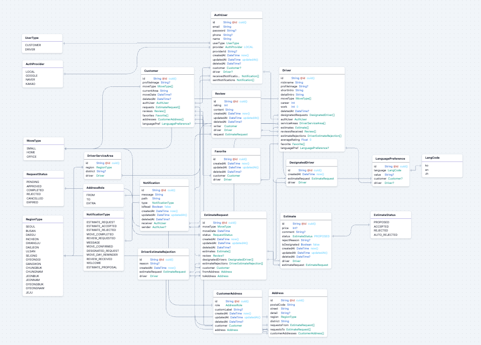

# 🖼️ Moving (BE)


# Simplify Your Move with Moving!

### [🖼️ Visit Moving](https://www.moving-2.click/)

### [📋 Team Notion](https://www.notion.so/217fff3108c98098bd43fdc393e922a1?v=217fff3108c981078f8c000cd9c3e859_link)

### [🔗 6-moving-team2-FE](https://github.com/sebiny/6-moving-team2-FE)

### [📚 Swagger API](https://api.moving-2.click/api-docs/)

<br>

## Table of Contents

1. [Project Overview](#1-project-overview)
2. [Demo](#2-demo)
3. [System Architecture](#3-system-architecture)
4. [Tech Stack](#4-tech-stack)
5. [Team & Documentation](#5-team--documentation)
6. [Troubleshooting](#6-troubleshooting)
7. [Folder Structure](#7-folder-structure)

---

## 1. Project Overview

- Moving is a platform that connects customers with professional moving service providers.
- When a customer submits their moving requirements, multiple verified moving companies can competitively submit estimates.
- Customers can compare different estimates at a glance and choose the most suitable price and conditions.
- Customer reviews help users independently evaluate and verify moving service providers.
- Moving aims to provide a transparent and fair moving experience while reducing the financial burden on customers.

---

## 2. Demo

| Landing Page                                                                                            | Real-time Notification                                                                                  | Request an Estimate                                                                                     | Find a Driver                                                                                             |
| ------------------------------------------------------------------------------------------------------- | ------------------------------------------------------------------------------------------------------- | ------------------------------------------------------------------------------------------------------- | --------------------------------------------------------------------------------------------------------- |
|  |  |  |  |

---

## 3. System Architecture


---

## 4. Tech Stack

| Category       | Tech Stack                                                                                                         |
| -------------- | ------------------------------------------------------------------------------------------------------------------ |
| **Backend**    | Node.js, Express, Nodemon, Prisma, PostgreSQL                                                                      |
| **Libraries**  | Passport, Superstruct, bcrypt, express-jwt, JSON Web Token, Multer, Jest, Swagger, OAuth, node-cron, Sentry, DeepL |
| **Deployment** | Amazon EC2, Amazon S3, Amazon RDS, Amazon CloudFront, Route 53, Nginx, Redis, Application Load Balancer            |
| **Tools**      | Git, GitHub, Notion, GitHub Actions                                                                                |

---

## 5. Team & Documentation

|                         |                                        |                                        |                            |                           |                               |                               |
| :---------------------: | :------------------------------------: | :------------------------------------: | :------------------------: | :-----------------------: | :---------------------------: | :---------------------------: |
|      **An Sebin**       |           **Choi Min-kyung**           |             **Kim Da-eun**             |       **Kim Dan-i**        |       **Oh Bo-ram**       |         **Lee Ji-su**         |      **Hwang Su-jeong**       |
|        Team Lead        |            Deputy Team Lead            |              Team Member               |        Team Member         |        Team Member        |          Team Member          |          Team Member          |
| Reviews<br>Localization | Driver My Page<br>Find a Driver<br>AWS | Customer Estimates<br>Favorite Drivers | Driver Estimates<br>Schema | Customer Estimate Request | Authentication & Users<br>AWS | Notifications<br>Landing Page |

### Documentation

- [An Sebin — GitHub](https://github.com/sebiny)
- [An Sebin — Development Report](https://www.notion.so/22afff3108c98004a243e75597d21347)

---

## 6. Troubleshooting

<details>

<summary><strong>[ Estimate Completion Scheduler ]</strong></summary>

### Problem

- There was no manual update functionality for completing an `EstimateRequest`.
- Moving requests whose `moveDate` had passed were not automatically changed to `COMPLETED`.
- There was no API endpoint that allowed users to manually mark an estimate request as completed.

### Solution

- Implemented a scheduler that automatically updates estimate requests to `COMPLETED` after the moving date has passed.
- Optimized performance by processing large amounts of data in batches.

</details>

<details>

<summary><strong>[ Driver Average Review Rating ]</strong></summary>

### Problem

- Certain features, such as sorting drivers by rating, were difficult to implement when calculating average ratings on the frontend.
- Floating-point calculation errors could accumulate and cause discrepancies from the actual average rating.
- The previous approach required multiple database calls when calculating the average review rating.

### Solution

- Although calculating the average requires some additional computation, the implementation was changed to recalculate the rating whenever a review is saved to ensure accuracy.
- After creating a review, all reviews for the driver were initially retrieved and the average rating was recalculated.
- This was later optimized by using `prisma.review.aggregate()` to calculate the average rating with a single database query immediately after creating a review.

</details>

---

## 7. Folder Structure

<details>

<summary>🗄️ ERD (Entity Relationship Diagram)</summary>

<div markdown="1">



</div>

</details>

<details>

<summary>Backend Folder Structure</summary>

```text
📦 be/                              # Backend project root
┣ 📂.github                         # GitHub configuration
┃ ┗ 📂workflows                     # CI/CD workflows
┃   ┗ 📜deploy.yml                  # Deployment pipeline
┣ 📂node_modules                    # Installed dependencies
┣ 📂prisma                          # Database-related files
┃ ┣ 📂migrations                    # Prisma migration files
┃ ┣ 📜schema.prisma                 # Prisma schema definition
┃ ┣ 📜seed.ts                       # Initial data seed script
┃ ┣ 📜seed2.ts                      # Additional seed data
┃ ┣ 📜seed3.ts                      # Test seed data
┃ ┗ 📜testSeed.ts                   # Test seed data
┣ 📂src                             # Source code
┃ ┣ 📂config                        # Configuration
┃ ┃ ├── 📜prisma.ts                 # Prisma client configuration
┃ ┃ └── 📜passport.ts                # Passport authentication configuration
┃ ┣ 📂controllers                   # Request/response handling
┃ ┃ ├── 📜auth.controller.ts        # Authentication controller
┃ ┃ ├── 📜driver.controller.ts      # Driver controller
┃ ┃ ├── 📜estimateReq.controller.ts # Estimate request controller
┃ ┃ ├── 📜customerEstimate.controller.ts
┃ ┃ │                                # Customer estimate controller
┃ ┃ ├── 📜notification.controller.ts
┃ ┃ │                                # Notification controller
┃ ┃ ├── 📜profile.controller.ts     # Profile controller
┃ ┃ ├── 📜review.controller.ts      # Review controller
┃ ┃ ├── 📜favorite.controller.ts    # Favorite driver controller
┃ ┃ ├── 📜address.controller.ts     # Address controller
┃ ┃ ├── 📜shareEstimate.controller.ts
┃ ┃ │                                # Shared estimate controller
┃ ┃ └── 📜*.controller.test.ts      # Controller test files
┃ ┣ 📂services                      # Business logic layer
┃ ┃ ├── 📜auth.service.ts
┃ ┃ ├── 📜driver.service.ts
┃ ┃ ├── 📜estimateReq.service.ts
┃ ┃ ├── 📜customerEstimate.service.ts
┃ ┃ ├── 📜notification.service.ts
┃ ┃ ├── 📜profile.service.ts
┃ ┃ ├── 📜review.service.ts
┃ ┃ ├── 📜favorite.service.ts
┃ ┃ ├── 📜address.service.ts
┃ ┃ ├── 📜estimateCompletion.service.ts
┃ ┃ └── 📜*.service.test.ts         # Service test files
┃ ┣ 📂repositories                  # Database access layer
┃ ┃ ├── 📜auth.repository.ts
┃ ┃ ├── 📜driver.repository.ts
┃ ┃ ├── 📜estimateReq.repository.ts
┃ ┃ ├── 📜customerEstimate.repository.ts
┃ ┃ ├── 📜notification.repository.ts
┃ ┃ ├── 📜profile.repository.ts
┃ ┃ ├── 📜review.repository.ts
┃ ┃ ├── 📜favorite.repository.ts
┃ ┃ ├── 📜address.repository.ts
┃ ┃ └── 📜*.repository.test.ts      # Repository test files
┃ ┣ 📂routes                        # Route definitions
┃ ┃ ├── 📜auth.router.ts
┃ ┃ ├── 📜driver.router.ts
┃ ┃ ├── 📜driverPrivate.router.ts
┃ ┃ ├── 📜estimateReq.router.ts
┃ ┃ ├── 📜customerEstimate.router.ts
┃ ┃ ├── 📜notification.router.ts
┃ ┃ ├── 📜profile.router.ts
┃ ┃ ├── 📜review.router.ts
┃ ┃ ├── 📜favorite.router.ts
┃ ┃ ├── 📜address.router.ts
┃ ┃ ├── 📜shareEstimate.router.ts
┃ ┃ └── 📜translateRouter.ts        # Translation router
┃ ┣ 📂middlewares                   # Express middleware
┃ ┃ ├── 📜errorHandler.ts            # Error handler
┃ ┃ ├── 📜authLimiter.ts             # Authentication rate limiter
┃ ┃ ├── 📜cacheMiddleware.ts         # Cache middleware
┃ ┃ ├── 📜uploadMiddleware.ts        # File upload middleware
┃ ┃ ├── 📜estimateCompletion.ts      # Estimate completion middleware
┃ ┃ └── 📂passport                  # Passport strategies
┃ ┃   ├── 📜jwtStrategy.ts            # JWT strategy
┃ ┃   └── 📜socialStrategy.ts         # Social login strategy
┃ ┣ 📂utils                          # Utility functions
┃ ┃ ├── 📜asyncHandler.ts             # Async handler wrapper
┃ ┃ ├── 📜customError.ts              # Custom error class
┃ ┃ ├── 📜getCookieDomain.ts           # Cookie domain configuration
┃ ┃ ├── 📜notificationMessage.ts       # Notification message generator
┃ ┃ ├── 📜cronScheduler.ts             # Cron scheduler
┃ ┃ ├── 📜estimateCompletionScheduler.ts
┃ ┃ │                                  # Estimate completion scheduler
┃ ┃ ├── 📜moveReminder.ts              # Moving reminder
┃ ┃ └── 📜resetDB.ts                   # Database reset utility
┃ ┣ 📂types                          # Type definitions
┃ ┃ ├── 📜index.d.ts                  # Global type definitions
┃ ┃ ├── 📜userType.ts                 # User type
┃ ┃ ├── 📜estimateReq.type.ts          # Estimate request type
┃ ┃ ├── 📜notification.type.ts         # Notification type
┃ ┃ ├── 📜review.type.ts               # Review type
┃ ┃ ├── 📜social.d.ts                  # Social login types
┃ ┃ └── 📜multer-s3.d.ts              # Multer S3 types
┃ ┣ 📂sse                           # Server-Sent Events implementation
┃ ┃ ├── 📜eventHub.ts                  # Event hub
┃ ┃ └── 📜sseEmitters.ts               # SSE emitters
┃ ┣ 📂dtos                          # Data Transfer Objects
┃ ┣ 📂integration-test              # Integration tests
┃ ┃ ├── 📜auth.test.ts
┃ ┃ ├── 📜driver.test.ts
┃ ┃ ├── 📜driverPrivate.test.ts
┃ ┃ ├── 📜estimateReq.test.ts
┃ ┃ ├── 📜customerEstimate.test.ts
┃ ┃ ├── 📜favorite.test.ts
┃ ┃ └── 📜notification.test.ts
┃ ┣ 📜app.ts                        # Express app initialization
┃ ┣ 📜instrument.ts                 # APM, monitoring & tracing configuration
┃ ┣ 📜server.ts                     # Server entry point
┃ └── 📜openapi.yaml                # OpenAPI specification
┣ 📜.env                             # Environment variables
┣ 📜.gitignore                       # Git ignore rules
┣ 📜.http                            # VS Code REST Client requests
┣ 📜.prettierrc                      # Prettier configuration
┣ 📜jest.config.js                   # Jest configuration
┣ 📜jest.setup.js                    # Jest test setup
┣ 📜openapi.yaml                     # OpenAPI specification
┣ 📜erd.png                          # Database ERD diagram
┗ 📜README.md                        # Project documentation
```

</details>
```
